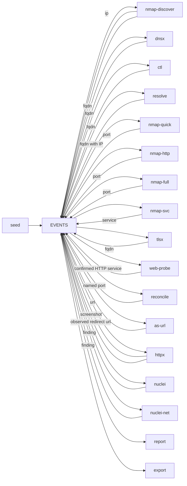

# adama

A reactive passive and active discovery process.

Tools register and subscribe themselves. Events, worker definitions, and work state persist until explicit cleanup. Scanner work is identified by tool, scope, and target; observation sinks receive distinct events. Durable leases, saved output batches, and finite execution budgets handle worker replacement. See [execution, recovery, and rollout](sdk/WORKFLOW.md).



```bash
python3 scripts/register-workers.py  # build and register the deployment; no scans
docker compose up -d --build
docker compose run --rm seed domain example.com
# or: seed fqdn / seed ip / seed netblock / seed port 192.168.1.1:22
# or: seed 192.168.1.1:22   (inferred as port)
docker compose logs -f watch
# live: http://127.0.0.1:8080
```

Scan only hosts you are allowed to touch. Tool flags live in `profiles/*.yaml` (`NMAP_PROFILE`, `HTTPX_PROFILE`, `NUCLEI_PROFILE`). NATS payload is 8MB (`nats.conf`). Live work is `watch` (`http://127.0.0.1:8080` or `docker compose logs -f watch`). Results are `reports/report.html`. Durable JSONL is `exports/events.jsonl`. Bus health is `http://127.0.0.1:8222`.

The Nuclei image installs templates into `/opt/nuclei-templates`; both profiles select that directory explicitly. The build must list a nonempty HTTP and SSL/TCP catalog with updates disabled before it succeeds. Runtime scans keep `-duc`; use `docker compose build --pull --no-cache nuclei nuclei-net` to refresh the baked-in catalog. If an earlier template failure paused either worker, recreate the repaired containers and use `work resume nuclei` / `work resume nuclei-net` to release pending work. Previously failed tasks still require a new scope to rescan.

## Event schema

Every tool accepts and emits the same versioned `event.Event`. Version 2 carries explicit endpoint identity, result details, and scan lineage. See the [observation contract](event/SCHEMA.md) for the complete fields, examples, and consumer rules.

| Field | Meaning |
|---|---|
| `host` | One IP address established by this observation; absent when unknown. |
| `name`, `name_role` | One hostname and its relationship to the IP: requested authority, DNS answer, PTR, certificate CN/SAN, or passive mention. |
| `port`, `proto` | Endpoint port and transport (`tcp`, `udp`, `icmp`, `icmpv6`, `arp`); omitted when unknown or inapplicable. |
| `url`, `sni`, `http_host` | URL and request authority context, preserving URL path/query case. |
| `service`, `tls` | Service name and whether TLS is established or specified by the URL. |
| `source`, `probe` | Worker and specific probe/template that produced the observation. |
| `info` | Result details, always string → string. Product/version, titles, matchers, and scripts belong here. |
| `id`, `run_id`, `scan_id`, `parent_id`, `input` | Observation ID, seed lineage, handler invocation, triggering event ID, and triggering subject snapshot. |

An event represents one observed relationship. DNS emits each name/address pair separately. Certificate names are recorded against the server that presented them, without asserting they resolve there. Scanners read the actual response IP; they do not copy an ancestor's address or choose an entry from an alias list. `input` preserves the requested context if the result differs.

The existing kinds and `value` locators remain:

| Kind | Value |
|---|---|
| `domain` | apex for dictionary enumeration (`example.com`) |
| `fqdn` | hostname |
| `netblock` | CIDR (`10.0.0.0/24`) |
| `ip` | IP address |
| `port` | `host:port` (IPv6 bracketed) |
| `service` | `host:port/service` |
| `url`, `screenshot` | HTTP(S) URL |
| `finding` | `nuclei/<template>/<input-value>` |

`value` alone is not an entity key: a named endpoint can have several responding IPs, and the same port number can use TCP or UDP. `meta` retains workflow gates (`allow`, `deny`, `scope`, `profile`, `alive`) and compatibility details. New consumers use the typed fields and `info`.

HTTP screenshot/vulnerability tools do **not** listen on raw `port`. `as-url` translates `service` names like `http`/`https` into `url`. `web-probe` checks unclassified TCP services for HTTP and HTTPS, then emits confirmed `service` observations into that same path. httpx and `nuclei` subscribe to `url`. `nuclei-net` takes non-web `service` events (`ssh`, `ssl`, …) and passes `host:port`.

## Tool registry

| Tool | In | Out | Notes |
|---|---|---|---|
| `seed` | — | whatever you pass | PoC injector |
| `nmap-discover` | `netblock`, `fqdn`, `ip` | live `ip`, live `fqdn` | YAML `-sn`; sets `meta.alive` |
| `dnsx` | `domain` | `fqdn` | dictionary (`wordlists/dns.txt`) |
| `ctl` | `domain` | `fqdn` | Shodan CT hostnames, kept only if dnsx sees A/AAAA |
| `resolve` | `domain`, unresolved `fqdn` | `fqdn` | explicit A/AAAA bindings, including the domain apex |
| `reconcile` | bound `fqdn`, open `port` | named `port` | persistent join in either arrival order; preserves IP, transport, scope, and gates |
| `nmap-quick` | live `ip`, live `fqdn` | `port` | YAML `--top-ports 250`; `-Pn`; any tool that sets `alive` |
| `nmap-http` | live `ip`, live `fqdn` | `port` | YAML; 25 common HTTP/S ports; same live gate |
| `nmap-full` | **live `ip`** | `port` | YAML `-sT -sU`; all TCP + common UDP; one scan per address |
| `nmap-svc` | `port` | `service` | YAML; matching TCP/UDP scan, `-sV` plus `default,safe,discovery` scripts; preserves TLS tunnel |
| `tlsx` | `port` | `fqdn` | TCP CN/SAN on every open port number; unsupported transports remain failed work |
| `as-url` | `service` | `url` | only confirmed http(s) service names |
| `web-probe` | unclassified TCP `service` | `service` | checks HTTP/HTTPS against the observed IP with the requested Host/SNI; no redirects |
| `httpx` | `url` | `screenshot`, `url` | HTTPX probes plus Chromium screenshots; final browser endpoint and observed redirect destinations |
| `nuclei` | `url` | `finding` | YAML; HTTP catalog minus dos/fuzz; OAST on |
| `nuclei-net` | `service` | `finding` | YAML; IP-bound `-pt ssl,tcp`; skips http(s); unsupported transports remain failed work |
| `report` | `screenshot`, `service`, `finding` | — | PoC HTML sink |
| `export` | all kinds | — | append-only JSONL (`EXPORT_FILE`) |


## Seeding (PoC only)

`seed` is a demo injector. `seed domain example.com` feeds dictionary/CT discovery and resolves the apex. `seed fqdn` resolves a single name (no dictionary). `seed netblock` is not exploded here — `nmap-discover` generates live IPs. `seed port 192.168.1.1:22` (or `seed 192.168.1.1:22`) asserts a known endpoint and goes straight to `nmap-svc`.

By default every subscriber runs. Optionally restrict a seed (children inherit the same gate):

```bash
docker compose run --rm seed --deny nmap-full,nuclei ip 192.168.1.1
docker compose run --rm seed --profile web --scope web1 ip 192.168.1.1
docker compose run --rm seed --run assessment-1 --scope assessment-1 --proto udp port 192.168.1.1:53
```

`--allow` / `--deny` are comma tool names. `--profile` loads `profiles/runs/<name>.yaml` (or a path). `--scope` is added to the dedup key so the same value can be seeded again under another kit. Empty allow/deny means all tools. In production, set the same `allow` / `deny` / `scope` meta yourself.

`--run` groups seed lineages for reporting; it defaults to the seed's generated ID. A new run ID alone does not force rescanning: choose a new scope for independent scan work. `--proto tcp|udp` applies to port seeds; the default is TCP.

## Report (PoC only)

Stand-in sink: POST `REPORT_URL` or `reports/events.jsonl` + `report.html`. Startup preserves JSONL and rebuilds HTML. Rows show endpoint identity, lineage, and `info`, including product/version and NSE scripts. This is still an observation viewer, not a normalized database. API requests carry the event ID as `Idempotency-Key`. For an all-kind feed, use `export`.

## JSONL export

`export` is an append-only pipe of the bus. Durable name **`export`** (gate `--allow` / `--deny` must use that, not `report`). Default file `exports/events.jsonl`; `EXPORT_FILE=-` writes stdout. It does not truncate on restart; JetStream resumes from the last ack.

Each line is one versioned observation envelope. Screenshot `data` is standard base64; lines can approach the 8MB NATS cap. `export` and `report` use SDK `Observe: true`, tracking event IDs instead of scanner target identities so subsequent observations and enrichment survive. Gates still apply. A crash between a sink write and recording completion can append the same event again; a database sink should commit its upserts and event ID together before returning success.

Use explicit endpoint fields for entity relationships and `parent_id` / `run_id` / `scan_id` for provenance. Do not infer a name × IP × port cross-product from legacy lists. See [consumer guidance and migration notes](event/SCHEMA.md#consumer-contract).

## Watch

`watch` is a live tail of who is working. SDK publishes `start` / `done` / `error` / `skip` on `adama.activity` (core NATS, not the EVENTS stream). Browser: `http://127.0.0.1:8080`. Terminal: `docker compose logs -f watch`.

Durable task outcomes and shared tool faults are available independently of watch:

```bash
docker compose run --rm work tasks
docker compose run --rm work tools
docker compose run --rm work registered
docker compose run --rm work coverage --scope web1
docker compose run --rm work coverage --run assessment-1
docker compose run --rm work resume httpx  # after repairing the tool
```

Ordinary failures stop after one execution. Explicitly transient failures get at most three executions by default; publication retries saved output separately. Resuming a repaired tool releases pending work without reopening terminal tasks. See [budgets, configuration, and migration requirements](sdk/WORKFLOW.md) before upgrading an existing cluster.

Coverage reconstructs expected work from retained events and the durable worker registry, including inputs whose worker never started. Each worker registers its actual SDK configuration: subscriptions, identity mode, prerequisites, eligibility rules, and required evidence. There is no central tool list or separate coverage profile. It reports unclaimed work, missing resolution/liveness, expired leases, failed tasks, and required evidence missing from otherwise successful executions. Every known backend and transport keeps its own identity. `--run` includes earlier runs sharing the same scopes because they share task state; an unscoped run therefore includes other unscoped work. Use distinct scopes for independent assessments.

`python3 scripts/register-workers.py` discovers services labeled `io.adama.worker=true` in Compose, invokes each worker with `ADAMA_REGISTER_ONLY=1`, and records the expected inventory using their returned names. Adding a worker means declaring its behavior once in `sdk.Config` and marking its Compose service with `<<: *worker`. Registration also happens on normal startup and survives worker shutdown. Registration-only mode skips executable checks, runtime setup, consumer creation, and handlers.

`work_complete_at_snapshot` applies only to the observed inputs and the reported stream sequence. Missing or unfinished deployment registration, changing state, removed history, or unknown allowlisted workers prevents a complete result. This does not seal a run or prove exact browser backend coverage. The command never retries tasks. See [worker registration and upgrades](sdk/WORKFLOW.md#worker-registration) for other orchestrators and deliberate contract changes.
