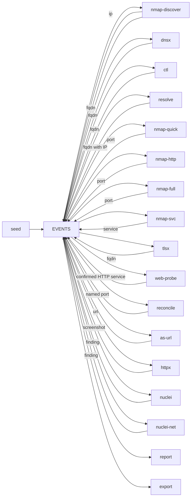

# adama

A reactive passive and active discovery process.

Tools register and subscribe themselves. Events, worker definitions, and work state persist until explicit cleanup. Scanner work is identified by tool, scope, and target; observation sinks receive distinct events. Durable leases, saved output batches, and finite execution budgets handle worker replacement. See [execution, recovery, and rollout](sdk/WORKFLOW.md).



```bash
python3 scripts/register-workers.py  # build and register the deployment; no scans
docker compose up -d --build
docker compose run --rm seed domain example.com
# or: seed fqdn / seed ip / seed netblock / seed port 192.168.1.1:22
# or: seed 192.168.1.1:22   (inferred as port)
docker compose logs -f watch
# live: http://127.0.0.1:8080
```

Scan only hosts you are allowed to touch. Tool flags live in `profiles/*.yaml` (`NMAP_PROFILE`, `HTTPX_PROFILE`, `NUCLEI_PROFILE`). NATS payload is 8MB (`nats.conf`). Live work is `watch` (`http://127.0.0.1:8080` or `docker compose logs -f watch`). Results are `reports/report.html`. Durable JSONL is `exports/events.jsonl`. Bus health is `http://127.0.0.1:8222`.

## Event schema

Every tool accepts and emits the same versioned `event.Event`. Version 2 carries explicit endpoint identity, result details, and scan lineage. See the [observation contract](event/SCHEMA.md) for the complete fields, examples, and consumer rules.

| Field | Meaning |
|---|---|
| `host` | One IP address established by this observation; absent when unknown. |
| `name`, `name_role` | One hostname and its relationship to the IP: requested authority, DNS answer, PTR, certificate CN/SAN, or passive mention. |
| `port`, `proto` | Endpoint port and transport (`tcp`, `udp`, `icmp`, `icmpv6`, `arp`); omitted when unknown or inapplicable. |
| `url`, `sni`, `http_host` | URL and request authority context, preserving URL path/query case. |
| `service`, `tls` | Service name and whether TLS is established or specified by the URL. |
| `source`, `probe` | Worker and specific probe/template that produced the observation. |
| `info` | Result details, always string → string. Product/version, titles, matchers, and scripts belong here. |
| `id`, `run_id`, `scan_id`, `parent_id`, `input` | Observation ID, seed lineage, handler invocation, triggering event ID, and triggering subject snapshot. |

An event represents one observed relationship. DNS emits each name/address pair separately. Certificate names are recorded against the server that presented them, without asserting they resolve there. Scanners read the actual response IP; they do not copy an ancestor's address or choose an entry from an alias list. `input` preserves the requested context if the result differs.

The existing kinds and `value` locators remain:

| Kind | Value |
|---|---|
| `domain` | apex for dictionary enumeration (`example.com`) |
| `fqdn` | hostname |
| `netblock` | CIDR (`10.0.0.0/24`) |
| `ip` | IP address |
| `port` | `host:port` (IPv6 bracketed) |
| `service` | `host:port/service` |
| `url`, `screenshot` | HTTP(S) URL |
| `finding` | `nuclei/<template>/<input-value>` |

`value` alone is not an entity key: a named endpoint can have several responding IPs, and the same port number can use TCP or UDP. `meta` retains workflow gates (`allow`, `deny`, `scope`, `profile`, `alive`) and compatibility details. New consumers use the typed fields and `info`.

HTTP screenshot/vulnerability tools do **not** listen on raw `port`. `as-url` translates `service` names like `http`/`https` into `url`. `web-probe` checks unclassified TCP services for HTTP and HTTPS, then emits confirmed `service` observations into that same path. httpx and `nuclei` subscribe to `url`. `nuclei-net` takes non-web `service` events (`ssh`, `ssl`, …) and passes `host:port`.

## Tool registry

| Tool | In | Out | Notes |
|---|---|---|---|
| `seed` | — | whatever you pass | PoC injector |
| `nmap-discover` | `netblock`, `fqdn`, `ip` | live `ip`, live `fqdn` | YAML `-sn`; sets `meta.alive` |
| `dnsx` | `domain` | `fqdn` | dictionary (`wordlists/dns.txt`) |
| `ctl` | `domain` | `fqdn` | Shodan CT hostnames, kept only if dnsx sees A/AAAA |
| `resolve` | `domain`, unresolved `fqdn` | `fqdn` | explicit A/AAAA bindings, including the domain apex |
| `reconcile` | bound `fqdn`, open `port` | named `port` | persistent join in either arrival order; preserves IP, transport, scope, and gates |
| `nmap-quick` | live `ip`, live `fqdn` | `port` | YAML `--top-ports 250`; `-Pn`; any tool that sets `alive` |
| `nmap-http` | live `ip`, live `fqdn` | `port` | YAML; 25 common HTTP/S ports; same live gate |
| `nmap-full` | **live `ip`** | `port` | YAML `-sT -sU`; all TCP + common UDP; one scan per address |
| `nmap-svc` | `port` | `service` | YAML; matching TCP/UDP scan, `-sV` plus `default,safe,discovery` scripts; preserves TLS tunnel |
| `tlsx` | `port` | `fqdn` | TCP CN/SAN on every open port number; unsupported transports remain failed work |
| `as-url` | `service` | `url` | only confirmed http(s) service names |
| `web-probe` | unclassified TCP `service` | `service` | checks HTTP/HTTPS against the observed IP with the requested Host/SNI; no redirects |
| `httpx` | `url` | `screenshot` | YAML profile; png/jpeg on `data` plus title/status/tech/cdn/asn/jarm |
| `nuclei` | `url` | `finding` | YAML; HTTP catalog minus dos/fuzz; OAST on |
| `nuclei-net` | `service` | `finding` | YAML; IP-bound `-pt ssl,tcp`; skips http(s); unsupported transports remain failed work |
| `report` | `screenshot`, `service`, `finding` | — | PoC HTML sink |
| `export` | all kinds | — | append-only JSONL (`EXPORT_FILE`) |

For hostname URLs with a known IP, `httpx` uses an independent, loopback DNS override for each task and a Chromium hostname mapping. This preserves the original URL, Host header, SNI, port, path, and query while selecting that backend. The shipped profile disables scheme fallback. Each invocation writes to its own `screenshots/capture-*` directory so replicas scanning different IPs for the same URL cannot overwrite artifacts. Results retain `info.artifact_dir`.

These controls live in `profiles/httpx.yaml`: `bound_args` expands `{resolver}`, `{name}`, and `{ip}` for bound hostname inputs. Optional `resolvers` selects upstream DNS (`IP:port` entries); otherwise other names use the container's `resolv.conf`. The override is routing data and is not exported as observed A/AAAA/CNAME records. Custom profiles should retain both scanner and browser binding controls; adding a proxy or changing those controls needs an endpoint integration check. A missing `bound_args` block pauses the tool on bound work instead of silently re-resolving it. No deployment-wide DNS change or privileged port is required. Upgrading the worker does not reopen completed or failed work; use a new scope when rescanning earlier results.

Browser redirects remain enabled. The top-level IP on a screenshot identifies the HTTP probe; `info.browser_endpoint_evidence=unreported` means HTTPX did not expose the final browser connection. Binding the initial hostname does not prove the endpoint of a redirected screenshot. See [local scanner integration checks](cmd/httpx/TESTING.md).

Both Nuclei profiles use a task-local resolver to select each known backend, preserving the hostname for ordinary/raw HTTP and TCP/TLS requests. YAML `bound_args` takes `{resolver_file}`; `resolvers` optionally selects upstream DNS. Only the input hostname is bound; other names, including redirect destinations, resolve normally. The shipped URL profile selects HTTP templates; the network profile selects TCP/TLS templates. Headless templates need separate browser controls.

The network profile declares `service_transports: [tcp]`. Unsupported inputs stay in task/coverage accounting and fail once before launching the scanner; they are not silently skipped or tested over a different transport. Successful network request logs are checked against the requested hostname, port, and transport, even without a finding. Unexpected-endpoint findings are retained with `info.requested_endpoint_status=mismatch`, and the task fails. TLSX also consumes every open port but reports unsupported transports and invalid targets as terminal failures.

DNS and JavaScript templates are no longer included in the generic service profile. DNS templates query configured resolvers rather than necessarily testing the observed DNS service, and synthetic binding answers are not DNS evidence. Mixing DNS templates into a bound scan pauses that worker and suppresses those DNS findings. JavaScript can choose arbitrary transports/endpoints; its current logs do not establish service coverage. Profiles remain editable without a central tool registry, but changing protocol selection requires corresponding endpoint evidence. These checks use scanner reports: SSL request traces can retain the original input when a template overrides its address, so exact SSL non-match destination accounting remains incomplete.

Both Nuclei workers inspect request traces configured by `trace_args` (`{trace_file}`). Request errors fail the task while retaining valid findings; a successful request with no match is a normal completion. Empty/missing/malformed execution evidence cannot establish completion. Negative matcher records and execution errors are not exported as findings. Missing trace/binding configuration or a missing template catalog pauses the tool instead of repeatedly launching it. Findings retain `scan_requests`, `scan_request_errors`, and `endpoint_evidence=scanner_reported` in `info`; redirected response attribution remains limited by Nuclei's output.

Nuclei profiles use `task_timeout` (15m HTTP, 10m network) for the SDK deadline, so timeout/cancellation remains visible with the existing finite attempt budget. Prefer this to a scanner-controlled early-exit flag such as `-max-time`, which does not itself prove the selected templates finished. See [Nuclei integration checks](cmd/nuclei/TESTING.md). Request traces account for emitted execution outcomes; they are not a certificate that every template in a catalog was applicable or executed.

`-Pn` scanners (`nmap-quick`, `nmap-http`, `nmap-full`) only run on `ip`/`fqdn` with `meta.alive=true`. `resolve` establishes name/address pairs before `nmap-discover` probes each specific IP. DNS answers are not liveness evidence. Full stays IP-only so ten vhosts share one `-sT -sU`. Quick/http take live names; `reconcile` also pairs late names with previously discovered ports outside those profiles. `tlsx` follows every open `port`.

## Seeding (PoC only)

`seed` is a demo injector. `seed domain example.com` feeds dictionary/CT discovery and resolves the apex. `seed fqdn` resolves a single name (no dictionary). `seed netblock` is not exploded here — `nmap-discover` generates live IPs. `seed port 192.168.1.1:22` (or `seed 192.168.1.1:22`) asserts a known endpoint and goes straight to `nmap-svc`.

By default every subscriber runs. Optionally restrict a seed (children inherit the same gate):

```bash
docker compose run --rm seed --deny nmap-full,nuclei ip 192.168.1.1
docker compose run --rm seed --profile web --scope web1 ip 192.168.1.1
docker compose run --rm seed --run assessment-1 --scope assessment-1 --proto udp port 192.168.1.1:53
```

`--allow` / `--deny` are comma tool names. `--profile` loads `profiles/runs/<name>.yaml` (or a path). `--scope` is added to the dedup key so the same value can be seeded again under another kit. Empty allow/deny means all tools. In production, set the same `allow` / `deny` / `scope` meta yourself.

`--run` groups seed lineages for reporting; it defaults to the seed's generated ID. A new run ID alone does not force rescanning: choose a new scope for independent scan work. `--proto tcp|udp` applies to port seeds; the default is TCP.

## Report (PoC only)

Stand-in sink: POST `REPORT_URL` or `reports/events.jsonl` + `report.html`. Startup preserves JSONL and rebuilds HTML. Rows show endpoint identity, lineage, and `info`, including product/version and NSE scripts. This is still an observation viewer, not a normalized database. API requests carry the event ID as `Idempotency-Key`. For an all-kind feed, use `export`.

## JSONL export

`export` is an append-only pipe of the bus. Durable name **`export`** (gate `--allow` / `--deny` must use that, not `report`). Default file `exports/events.jsonl`; `EXPORT_FILE=-` writes stdout. It does not truncate on restart; JetStream resumes from the last ack.

Each line is one versioned observation envelope. Screenshot `data` is standard base64; lines can approach the 8MB NATS cap. `export` and `report` use SDK `Observe: true`, tracking event IDs instead of scanner target identities so subsequent observations and enrichment survive. Gates still apply. A crash between a sink write and recording completion can append the same event again; a database sink should commit its upserts and event ID together before returning success.

Use explicit endpoint fields for entity relationships and `parent_id` / `run_id` / `scan_id` for provenance. Do not infer a name × IP × port cross-product from legacy lists. See [consumer guidance and migration notes](event/SCHEMA.md#consumer-contract).

## Watch

`watch` is a live tail of who is working. SDK publishes `start` / `done` / `error` / `skip` on `adama.activity` (core NATS, not the EVENTS stream). Browser: `http://127.0.0.1:8080`. Terminal: `docker compose logs -f watch`.

Durable task outcomes and shared tool faults are available independently of watch:

```bash
docker compose run --rm work tasks
docker compose run --rm work tools
docker compose run --rm work registered
docker compose run --rm work coverage --scope web1
docker compose run --rm work coverage --run assessment-1
docker compose run --rm work resume httpx  # after repairing the tool
```

Ordinary failures stop after one execution. Explicitly transient failures get at most three executions by default; publication retries saved output separately. Resuming a repaired tool releases pending work without reopening terminal tasks. See [budgets, configuration, and migration requirements](sdk/WORKFLOW.md) before upgrading an existing cluster.

Coverage reconstructs expected work from retained events and the durable worker registry, including inputs whose worker never started. Each worker registers its actual SDK configuration: subscriptions, identity mode, prerequisites, eligibility rules, and required evidence. There is no central tool list or separate coverage profile. It reports unclaimed work, missing resolution/liveness, expired leases, failed tasks, and required evidence missing from otherwise successful executions. Every known backend and transport keeps its own identity. `--run` includes earlier runs sharing the same scopes because they share task state; an unscoped run therefore includes other unscoped work. Use distinct scopes for independent assessments.

`python3 scripts/register-workers.py` discovers services labeled `io.adama.worker=true` in Compose, invokes each worker with `ADAMA_REGISTER_ONLY=1`, and records the expected inventory using their returned names. Adding a worker means declaring its behavior once in `sdk.Config` and marking its Compose service with `<<: *worker`. Registration also happens on normal startup and survives worker shutdown. Registration-only mode skips executable checks, runtime setup, consumer creation, and handlers.

`work_complete_at_snapshot` applies only to the observed inputs and the reported stream sequence. Missing or unfinished deployment registration, changing state, removed history, or unknown allowlisted workers prevents a complete result. This does not seal a run or prove exact browser backend coverage. The command never retries tasks. See [worker registration and upgrades](sdk/WORKFLOW.md#worker-registration) for other orchestrators and deliberate contract changes.
