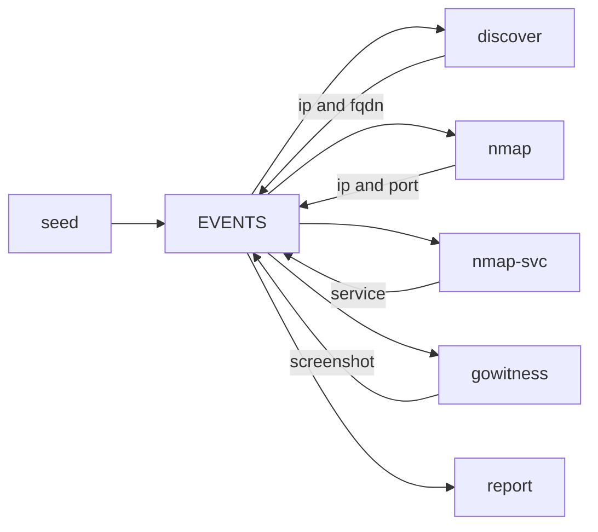

# adama

A reactive passive and active discovery process.

Tools subscribe themselves. Events live 24h. Dedup is per `(tool, kind, value)`.



```bash
docker compose up -d --build nats discover nmap nmap-svc gowitness report
docker compose run --rm seed fqdn example.com
# or: docker compose run --rm seed netblock 203.0.113.0/24
ls screenshots reports
# open reports/report.html
docker compose logs -f discover nmap nmap-svc gowitness report
```

Scan only hosts you are allowed to touch.

## Seeding (PoC only)

The `seed` CLI is a demo injector. It publishes one event (`fqdn`, `netblock`, `ip`, `port`, …) onto the bus so you can kick a local chain.

A netblock is **not** exploded at seed time. `discover` (`nmap -sn`) emits live `ip`s (and PTR `fqdn`s); nmap and the rest pick those up.

In a real environment you would not run this binary. Whatever already knows about a new name, block, or host should publish the same event shape to `adama.event.{kind}`. Tickets, asset feeds, other scanners — they are the seed.

## Report (PoC only)

The `report` worker is a stand-in for a sink you own. Here it either POSTs `screenshot` and `service` events to `REPORT_URL`, or writes `reports/events.jsonl` and rebuilds `reports/report.html`. Screenshot events carry the jpeg on `data`. `REPORT_KINDS` can add more kinds.

Do not treat this as the product. Persist and merge findings in your own app: subscribe to the same subjects (or set `REPORT_URL` to an API that already knows how to merge). The HTML file is only so the PoC is visible.
