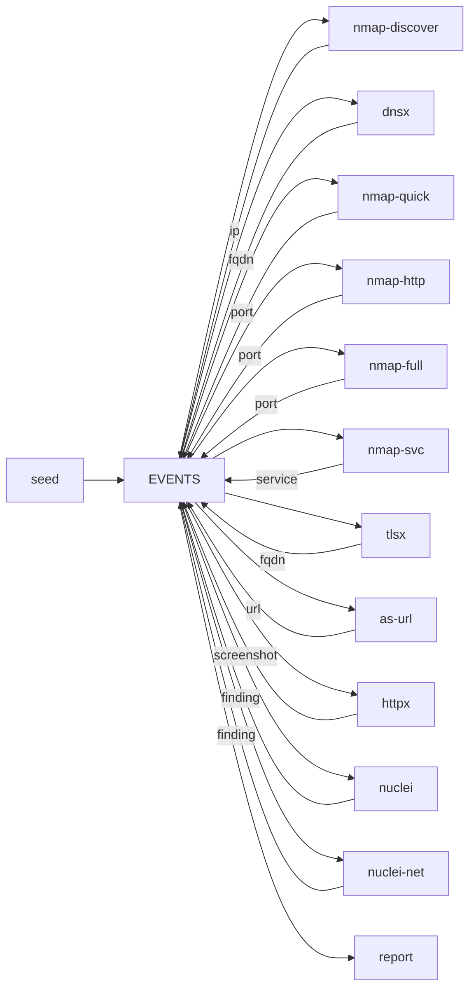

# adama

A reactive passive and active discovery process.

Tools subscribe themselves. Events live 24h. Dedup is per `(tool, kind, value)`.



```bash
docker compose up -d --build
docker compose run --rm seed domain example.com
# or: seed fqdn / seed ip / seed netblock / seed port 192.168.1.1:22
# or: seed 192.168.1.1:22   (inferred as port)
docker compose logs -f watch
# live: http://127.0.0.1:8080
```

Scan only hosts you are allowed to touch. Tool flags live in `profiles/*.yaml` (`NMAP_PROFILE`, `HTTPX_PROFILE`, `NUCLEI_PROFILE`). NATS payload is 8MB (`nats.conf`). Live work is `watch` (`http://127.0.0.1:8080` or `docker compose logs -f watch`). Results are `reports/report.html`. Bus health is `http://127.0.0.1:8222`.

## Event schema

Every tool speaks the same envelope. Naabu, nmap, httpx, etc. should emit these kinds rather than inventing new ones.

| Kind | Value | Typical meta |
|---|---|---|
| `domain` | apex for dictionary enum (`example.com`) | |
| `fqdn` | a hostname | `parent`, `via`, `netblock` |
| `netblock` | CIDR (`10.0.0.0/24`) | |
| `ip` | address | `fqdns`, `netblock` |
| `port` | `host:port` | `host`, `port`, `fqdns`, `ips` |
| `service` | `host:port/name` | **`name`, `product`, `version`**, `scripts` (id→output JSON) |
| `url` | `http(s)://host` | `host`, `port`, `name`, `product` |
| `screenshot` | URL | image on `data`; title/status/tech/etc in meta |
| `finding` | `nuclei/<template>/<target>` | `template`, `severity`, `name`, `extracted`, `description`, `tags`, `matcher` |

`service.product` / `version` is how you *see* what nmap (or anything else) fingerprinted. `nmap-svc` fills it; another tool can emit the same `service` shape.

HTTP tools do **not** listen on raw `port`. `as-url` translates `service` names like `http`/`https` into `url`. httpx and `nuclei` subscribe to `url`. `nuclei-net` takes non-web `service` events (`ssh`, `ssl`, …) and passes `host:port`.

## Tool registry

| Tool | In | Out | Notes |
|---|---|---|---|
| `seed` | — | whatever you pass | PoC injector |
| `nmap-discover` | `netblock` | `ip`, `fqdn` | YAML ping sweep (`-sn`); probes/rate in profile |
| `dnsx` | `domain` | `fqdn` | dictionary (`wordlists/dns.txt`) |
| `nmap-quick` | `fqdn`, `ip` | `ip`, `port` | YAML; nmap `--top-ports 1000` |
| `nmap-http` | `fqdn`, `ip` | `port` | YAML; fat HTTP/S port list (vhost `:8080` etc.) |
| `nmap-full` | **`ip` only** | `port` | YAML `-sT -sU`; all TCP + common UDP; one scan per address |
| `nmap-svc` | `port` | `service` | YAML; `-sV` plus `default,safe,discovery` scripts |
| `tlsx` | `port` (443) | `fqdn` | CN/SAN names plus cert meta |
| `as-url` | `service` | `url` | only if nmap says http(s) |
| `httpx` | `url` | `screenshot` | YAML profile; png/jpeg on `data` plus title/status/tech/cdn/asn/jarm |
| `nuclei` | `url` | `finding` | YAML; HTTP catalog minus dos/fuzz; OAST on |
| `nuclei-net` | `service` | `finding` | YAML; `-pt ssl,tcp,dns,javascript`; skips http(s) |
| `report` | `screenshot`, `service`, `finding` | — | PoC sink |

`nmap-quick`, `nmap-http`, and `nmap-full` are **separate consumers** (`profiles/*.yaml`). Duplicate work is fine. Full scan is IP-only so ten vhosts on one host do not get ten `-p-` runs; they still each get quick (top-1000), the HTTP port sweep, and HTTP tools (SNI).

## Seeding (PoC only)

`seed` is a demo injector. `seed domain example.com` feeds dnsx. `seed fqdn` is a single name (no dictionary). `seed netblock` is not exploded here — `nmap-discover` generates live IPs. `seed port 192.168.1.1:22` (or `seed 192.168.1.1:22`) skips discovery and goes straight to `nmap-svc`.

By default every subscriber runs. Optionally restrict a seed (children inherit the same gate):

```bash
docker compose run --rm seed --deny nmap-full,nuclei ip 192.168.1.1
docker compose run --rm seed --profile web --scope web1 ip 192.168.1.1
```

`--allow` / `--deny` are comma tool names. `--profile` loads `profiles/runs/<name>.yaml` (or a path). `--scope` is added to the dedup key so the same value can be seeded again under another kit. Empty allow/deny means all tools. In production, set the same `allow` / `deny` / `scope` meta yourself.

## Report (PoC only)

Stand-in sink: POST `REPORT_URL` or `reports/events.jsonl` + `report.html`. The file sink resets on startup. Service rows show **product/version** and NSE `scripts` JSON. Replace this with your merge API.

## Watch

`watch` is a live tail of who is working. SDK publishes `start` / `done` / `error` / `skip` on `adama.activity` (core NATS, not the EVENTS stream). Browser: `http://127.0.0.1:8080`. Terminal: `docker compose logs -f watch`.
