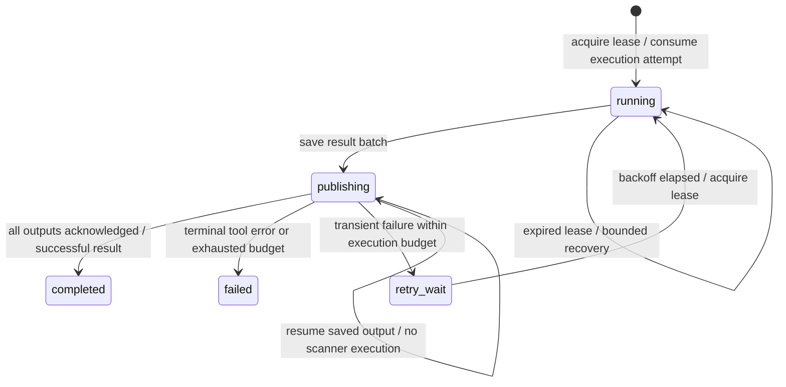

# Work execution and recovery

Each scanner still subscribes to the existing event kinds. The SDK now separates receiving a message, executing a tool, persisting its output, and completing publication. `ADAMA_WORK` stores task state and `ADAMA_OUTBOX` stores result batches, both in JetStream file storage without an expiry. `ADAMA_TOOLS` holds shared tool faults; `ADAMA_FACTS` holds name/endpoint relationships. `ADAMA_REGISTRY` retains worker execution contracts and deployment inventory.



## Execution rules

- A task is identified by tool, scope, and the v2 target/work identity. Observation sinks use `(tool, event ID)` instead, so enrichment and distinct observations survive while redelivery of an already handled ID is skipped.
- Gates, liveness checks, and pure worker eligibility filters run before a claim. Already-resolved names, discovery's own live outputs, and the reconciler's own output do not create no-op tasks or outboxes.
- A claim is a renewable lease, not proof of completion. Each execution increments the durable attempt count before invoking the handler. Crashes and cancellation consume an attempt. Terminal states and budgets have no TTL; replay and new copies of the same logical input cannot reset them.
- Leases and terminal writes use KV revision checks. Another replica defers an active lease. It can recover an expired lease; an old owner cannot overwrite the replacement's work state. Heartbeats renew both the KV lease and JetStream acknowledgement timer.
- All children get IDs and lineage before the batch is saved to the outbox. Publication advances a persisted output index, and sends the event ID as `Nats-Msg-Id`. Recovery can find an outbox saved before the publishing-state transition. It resumes those outputs without executing the scanner again.
- A partial result plus an error is saved and published, then recorded as failed or retryable. Successful empty results are completed. Invalid/oversized children are not published and make the task fail; valid siblings survive.
- Shutdown stops pulling, cancels the active tool, waits for its handler to return within the configured grace, and uses independent bounded contexts to persist its outcome. Linux/macOS subprocess cancellation kills the tool's process group, including browser children. A handler that ignores cancellation is terminally failed; custom handlers must cooperate with their context.

There is no exactly-once execution claim. A crash before saving the result can require another execution within the remaining budget. A state-storage outage can prevent saving a result. Lease cancellation cannot undo an already sent network probe. External sink side effects can occur before their completion record is saved; database/API sinks must use the stable event ID for idempotency.

## Failure policy

Ordinary errors are terminal after one execution. This includes malformed tool output, unclassified nonzero process exits, invalid output events, and missing screenshots. Only an explicit `sdk.Retryable(err)`, deadline expiry, or cooperative cancellation uses the retry budget. Defaults allow three total executions, delayed by 10 seconds then 20 seconds, plus jitter; the retry window ends 24 hours after the task is created.

Publication has a separate limit of five publication passes. It always uses the saved batch and never spends another scanner execution to repair a publish failure. Exhaustion leaves a terminal failure with the outbox key and last published index available for inspection. There is no automatic failed-work recycling.

Missing executables are checked before consuming work. Recognized shared faults, such as unsupported flags and HTTPX browser startup failures, use `sdk.ToolUnavailable(err)` and pause that tool across replicas. Pending inputs wait; other tools continue. After repairing the installation/profile, explicitly resume the tool. Already terminal tasks remain terminal; use a new scope for an explicit rescan.

```bash
docker compose run --rm work tasks       # durable task records, JSONL
docker compose run --rm work tools       # shared tool faults, JSONL
docker compose run --rm work resume httpx
```

Task records include input identity, scope/run, status, attempts/budgets, lease owner/deadline, error, output count, and outbox key. `work coverage` compares those records against expected work reconstructed from retained observations, so it also accounts for inputs no worker has claimed.

## Coverage snapshots

```bash
docker compose run --rm work coverage --scope web1
docker compose run --rm work coverage --run assessment-1
```

The command reads a fixed EVENTS sequence boundary and loads worker definitions from `ADAMA_REGISTRY`. It evaluates the same serialized eligibility rules used by workers and compares each expected work key with `ADAMA_WORK`; observation consumers retain separate event identities. The report includes consumer existence/backlog and shared tool pauses. Consumer backlog counts are global for the tool, not limited to the selected scope.

Unclaimed work remains visible when a worker is absent or starts late. Resolution and liveness blockers are reconciled against later observations in either order, separately for every bound IP. A domain includes an apex-resolution requirement. Discovery, address resolution, service identification, and screenshot executions that complete without producing their required evidence are identified separately from successful scans with no open ports or findings. Failed tasks remain failed; inspection never reschedules them.

Run IDs do not isolate work. Selecting a run includes all retained events in that run's scopes, including earlier outputs from reused tasks. The report lists these `shared_scopes`; the empty scope includes all unscoped work. Use `--scope` for an explicit assessment boundary and new scopes for rescanning.

`work_complete_at_snapshot` requires all expected work to be completed, required evidence present, retained history intact, deployment inventory ready, and no event/work/registration changes during the snapshot. The sequence and timestamp qualify the result: more seeds can extend a run afterward. Deleted history, no matching events, unknown allowlisted workers, and missing expected registrations cannot produce a complete result. Snapshots currently read the retained stream and are intended for inspection, not constant polling of a large archive. The timeout defaults to five minutes.

This is task coverage of observed inputs, not proof that every possible hostname, port, or vulnerability exists in the inventory. It does not yet provide a sealed run lifecycle, port-range/UDP uncertainty accounting, or independently verified browser navigation endpoints.

## Worker registration

`sdk.Run` publishes a versioned execution contract from its own `Config` before checking executables, performing runtime setup, or consuming messages. It includes the effective name/kinds from the worker's profile, `Observe`, `NeedLive`, `NeedBinding`, `Evidence`, and `Filter`. The SDK evaluates `Filter` before taking a work claim; coverage evaluates the identical persisted rule. Rules support `All`, `Any`, `Not`, `FieldIn`, and `Has` over canonical event fields. Unknown fields/versions and invalid rule combinations fail validation. There is no tool-name switch or tool-specific predicate registry.

Definitions persist without TTL or deregistration on shutdown. A missing binary still leaves a registered worker whose unclaimed work is visible. Identical replicas register idempotently. Different execution contracts under the same worker name fail startup instead of replacing each other; profile flags and scanner/template versions are not part of this scheduling contract.

For initial deployment, generate the expected inventory directly from Compose:

```bash
python3 scripts/register-workers.py
docker compose up -d
docker compose run --rm work registered
docker compose run --rm work inventory
```

The script builds worker images and the operations CLI, starts NATS, and discovers worker services through the `io.adama.worker=true` label (`<<: *worker` in Compose). Each service runs once with `ADAMA_REGISTER_ONLY=1`, returning its actual contract without checking scanner binaries, running `Setup`, creating consumers, or invoking handlers. The script records the resulting worker names as the expected inventory. It marks provisioning incomplete before changing registrations; failures/interruption leave that state visible and cannot certify coverage. `--no-build` uses images already rebuilt with registration support.

Other orchestrators can invoke the same registration-only mode and generate `work inventory set WORKER...` from the returned definitions, with `work inventory begin` before provisioning. Coverage without an inventory still lists known work, but cannot certify completion: the cluster cannot infer an unknown worker that has never contacted it. New workers automatically join coverage when they register. Existing definitions remain expected even when their containers disappear; intentionally retiring a tool requires deliberate registry/inventory administration, not replica shutdown.

For a changed execution contract, stop the affected replicas, run `python3 scripts/register-workers.py --replace`, migrate any incompatible JetStream consumer settings as described below, then restart. Replacement updates definitions but never clears task records or retries terminal work; use a new scope for independent work. Keep runtime initialization in `Config.Setup` so provisioning can register a worker even when its runtime dependencies are unavailable.

## Worker settings

Set these on worker containers; corresponding `sdk.Config` fields take precedence. Existing profile `ack_wait` sets both the default task timeout and acknowledgement timeout. Heartbeats allow healthy work to remain leased throughout that interval.

| Environment | Default | Meaning |
|---|---|---|
| `ADAMA_MAX_ATTEMPTS` | `3` | Total scanner executions per logical task. |
| `ADAMA_MAX_PUBLISH_ATTEMPTS` | `5` | Passes through a saved output batch. |
| `ADAMA_TASK_TIMEOUT` | profile `ack_wait`, otherwise `5m` | Timeout for one handler invocation. |
| `ADAMA_RETRY_WINDOW` | `24h` | Deadline for starting another scanner execution. |
| `ADAMA_RETRY_DELAY` | `10s` | Initial delay, doubled per attempt with jitter; base capped at `10m`. |
| `ADAMA_LEASE_DURATION` | `30s` | Renewable work lease. |
| `ADAMA_SHUTDOWN_GRACE` | `5s` | Wait for a canceled handler to stop. Compose gives containers 30 seconds to exit. |
| `ADAMA_MAX_PENDING` | `32` | Outstanding deliveries across all replicas of a tool. Each replica pulls one at a time. |

The reconciler and file-backed HTML reporter set `MaxPending: 1` to serialize their updates. Scanner replicas can work on different targets concurrently. Task budgets are stored on first creation; changing configuration cannot reopen terminal work or increase an existing task's budget.

JetStream transport deliveries are unlimited so waiting on a lease or replacing a worker cannot discard unfinished work merely by using up a message's delivery count. **Scanner executions are still strictly bounded by durable task state.** Delayed delivery during a storage outage does not mean a tool is running. See the [NATS consumer documentation](https://docs.nats.io/learn/jetstream/pull-consumers) for delivery and acknowledgement behavior.

## Discovery and late relationships

`resolve` accepts `domain` and unresolved `fqdn` inputs, resolving every A/AAAA answer. This covers the apex independently of wordlist/CT enumeration. `nmap-discover` waits for an explicit name/address binding and probes that IP; it no longer resolves a raw name independently to just one backend. Only a successful discovery probe sets `meta.alive`.

`reconcile` observes bound FQDNs and open ports. It stores either side before looking for the other, then emits named `port` observations for each supported pair. Thus a late hostname can receive service/HTTP work on TCP/45678 discovered by an earlier full scan. Its facts survive worker restarts, and its own output does not feed another join. Existing work keys prevent the service scanner from repeating a pair already produced by quick/HTTP scanning.

Joins require the same scope and IP, preserve TCP/UDP, and accept only requested or forward-resolved name bindings. PTR/certificate mentions first go through resolution. Gates are intersected, with deny lists combined; joining two facts cannot broaden either fact's allowed downstream tools. Output details retain both evidence event IDs. Custom allowlists must include `resolve` and `reconcile`; the bundled web profile includes them and its discovery prerequisites.

This closes scheduling gaps for known name/address/open-port combinations. HTTPX now binds the initial hostname to the input IP in both its probe resolver and browser mapping, with arguments kept in its YAML profile. Invocation-specific artifact directories isolate concurrent backends. Unexpected-backend observations survive, but the task fails when the reported probe IP differs from the input IP (or is absent), the result URL changes, or an image is missing. Missing binding configuration pauses the tool. Exact redirected-browser evidence remains separate work; scheduling a URL alone does not prove backend coverage.

Nuclei's HTTP and TCP/TLS workers bind known backends through a per-task resolver, returning only the selected IPv4 or IPv6 address for the input hostname. Other names resolve normally. Both profiles record request traces: request failures and missing execution evidence fail the task while retaining valid findings. A successful non-match is allowed; network request logs must identify the requested authority, port, and transport. Mismatched findings retain their observed endpoint and fail the task. SDK `task_timeout` owns the scan deadline so expiry cannot silently look like a completed scan. Missing trace/binding configuration, no loaded templates, or DNS templates mixed with synthetic binding pauses the tool. Synthetic DNS findings are suppressed.

The network profile's `service_transports` declares supported transports. Unsupported inputs remain expected work and fail once before subprocess execution; changing filters to hide them would erase the gap from coverage. TLSX likewise reports unsupported transports instead of scanning UDP inputs over TCP. Defaults select TCP/TLS templates; DNS, JavaScript, headless, exact SSL non-match destinations, and final redirected-response evidence need separate accounting. Request logs do not assert that every catalog template ran. Profile/code upgrades do not reopen terminal work; use a new scope for a deliberate rescan.

`web-probe` fills the identification gap for `unknown`, `ssl`, `tls`, `ssl/unknown`, and `tcpwrapped` TCP services with known IPs. It makes at most one GET per HTTP/HTTPS scheme, connecting directly to that IP while retaining the requested Host/SNI. It does not follow redirects or use environment proxies. Any HTTP status confirms the service; certificate trust is not a prerequisite for identification. Response headers and per-scheme deadlines are bounded (`WEB_PROBE_TIMEOUT`, default five seconds). Confirmed services reach `as-url` normally. A negative result is a service observation with `http_probe_status=not_detected`; a timeout with no positive result is `inconclusive` and terminal by default. Its own diagnostic outputs never trigger another probe.

Nmap workers validate XML completion in addition to subprocess exit status. A missing completion record, an error exit in the XML, or a host marked timed out fails the task while preserving successfully parsed open endpoints. These checks follow the [Nmap XML specification](https://nmap.org/book/nmap-dtd.html); a process returning zero alone is insufficient evidence of complete coverage.

## Retention and rollout

New consumers start from retained history. Workers verify existing durable filters, delivery policy, acknowledgement timeout, and delivery limits; incompatible settings fail startup instead of silently attaching to an old configuration. Existing consumers created with `DeliverNew` require an explicit migration before these workers start. Back up retained events and consumers first. Do not delete consumers or replay production history as part of a routine build.

`EVENTS`, task state, outboxes, facts, and tool faults now have no automatic age expiry. The Compose NATS service stores them in the `nats-data` volume. A volume survives container replacement; it is not replicated high availability or a backup. Monitor disk use and archive/clean up completed assessments deliberately. Existing expired events cannot be recovered by increasing retention.

The old `ADAMA_DEDUP` claim markers cannot prove work completed, so they are not imported into `ADAMA_WORK`. Replaying retained inputs after migration can execute previously scanned targets again. Old container-local NATS data also needs a deliberate copy into the new persistent store before replacing a running container; this code change does not perform that migration.

Use a distinct `meta.scope` for each independent assessment. A new `run_id` alone does not reset work state. None of these changes delete live NATS data, migrate running consumers, or automatically retry terminal failures.

The report rebuilds its HTML from its existing JSONL on startup instead of truncating it. Report/export sync file writes before successful completion. Their append-only files may contain redeliveries from a crash between the append and recording completion; consumers should treat event IDs as idempotency keys. The HTML viewer still reads/rebuilds the whole report per event and is not a normalized database.
