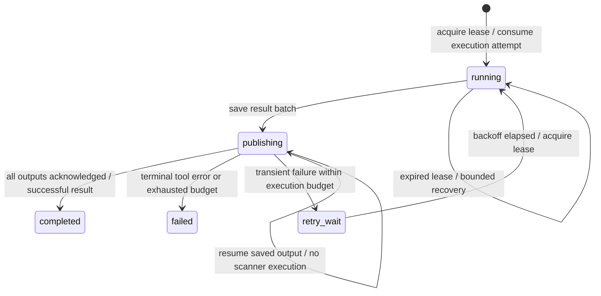

# Work execution and recovery

Each scanner still subscribes to the existing event kinds. The SDK now separates receiving a message, executing a tool, persisting its output, and completing publication. `ADAMA_WORK` stores task state and `ADAMA_OUTBOX` stores result batches, both in JetStream file storage without an expiry. `ADAMA_TOOLS` holds shared tool faults; `ADAMA_FACTS` holds name/endpoint relationships.



## Execution rules

- A task is identified by tool, scope, and the v2 target/work identity. Observation sinks use `(tool, event ID)` instead, so enrichment and distinct observations survive while redelivery of an already handled ID is skipped.
- Gates, liveness checks, and pure worker eligibility filters run before a claim. Already-resolved names, discovery's own live outputs, and the reconciler's own output do not create no-op tasks or outboxes.
- A claim is a renewable lease, not proof of completion. Each execution increments the durable attempt count before invoking the handler. Crashes and cancellation consume an attempt. Terminal states and budgets have no TTL; replay and new copies of the same logical input cannot reset them.
- Leases and terminal writes use KV revision checks. Another replica defers an active lease. It can recover an expired lease; an old owner cannot overwrite the replacement's work state. Heartbeats renew both the KV lease and JetStream acknowledgement timer.
- All children get IDs and lineage before the batch is saved to the outbox. Publication advances a persisted output index, and sends the event ID as `Nats-Msg-Id`. Recovery can find an outbox saved before the publishing-state transition. It resumes those outputs without executing the scanner again.
- A partial result plus an error is saved and published, then recorded as failed or retryable. Successful empty results are completed. Invalid/oversized children are not published and make the task fail; valid siblings survive.
- Shutdown stops pulling, cancels the active tool, waits for its handler to return within the configured grace, and uses independent bounded contexts to persist its outcome. Linux/macOS subprocess cancellation kills the tool's process group, including browser children. A handler that ignores cancellation is terminally failed; custom handlers must cooperate with their context.

There is no exactly-once execution claim. A crash before saving the result can require another execution within the remaining budget. A state-storage outage can prevent saving a result. Lease cancellation cannot undo an already sent network probe. External sink side effects can occur before their completion record is saved; database/API sinks must use the stable event ID for idempotency.

## Failure policy

Ordinary errors are terminal after one execution. This includes malformed tool output, unclassified nonzero process exits, invalid output events, and missing screenshots. Only an explicit `sdk.Retryable(err)`, deadline expiry, or cooperative cancellation uses the retry budget. Defaults allow three total executions, delayed by 10 seconds then 20 seconds, plus jitter; the retry window ends 24 hours after the task is created.

Publication has a separate limit of five publication passes. It always uses the saved batch and never spends another scanner execution to repair a publish failure. Exhaustion leaves a terminal failure with the outbox key and last published index available for inspection. There is no automatic failed-work recycling.

Missing executables are checked before consuming work. Recognized shared faults, such as unsupported flags and HTTPX browser startup failures, use `sdk.ToolUnavailable(err)` and pause that tool across replicas. Pending inputs wait; other tools continue. After repairing the installation/profile, explicitly resume the tool. Already terminal tasks remain terminal; use a new scope for an explicit rescan.

```bash
docker compose run --rm work tasks       # durable task records, JSONL
docker compose run --rm work tools       # shared tool faults, JSONL
docker compose run --rm work resume httpx
```

Task records include input identity, scope/run, status, attempts/budgets, lease owner/deadline, error, output count, and outbox key. These records account for work received by a worker; they are not yet a complete desired-work planner or a run-completion certificate.

## Worker settings

Set these on worker containers; corresponding `sdk.Config` fields take precedence. Existing profile `ack_wait` sets both the default task timeout and acknowledgement timeout. Heartbeats allow healthy work to remain leased throughout that interval.

| Environment | Default | Meaning |
|---|---|---|
| `ADAMA_MAX_ATTEMPTS` | `3` | Total scanner executions per logical task. |
| `ADAMA_MAX_PUBLISH_ATTEMPTS` | `5` | Passes through a saved output batch. |
| `ADAMA_TASK_TIMEOUT` | profile `ack_wait`, otherwise `5m` | Timeout for one handler invocation. |
| `ADAMA_RETRY_WINDOW` | `24h` | Deadline for starting another scanner execution. |
| `ADAMA_RETRY_DELAY` | `10s` | Initial delay, doubled per attempt with jitter; base capped at `10m`. |
| `ADAMA_LEASE_DURATION` | `30s` | Renewable work lease. |
| `ADAMA_SHUTDOWN_GRACE` | `5s` | Wait for a canceled handler to stop. Compose gives containers 30 seconds to exit. |
| `ADAMA_MAX_PENDING` | `32` | Outstanding deliveries across all replicas of a tool. Each replica pulls one at a time. |

The reconciler and file-backed HTML reporter set `MaxPending: 1` to serialize their updates. Scanner replicas can work on different targets concurrently. Task budgets are stored on first creation; changing configuration cannot reopen terminal work or increase an existing task's budget.

JetStream transport deliveries are unlimited so waiting on a lease or replacing a worker cannot discard unfinished work merely by using up a message's delivery count. **Scanner executions are still strictly bounded by durable task state.** Delayed delivery during a storage outage does not mean a tool is running. See the [NATS consumer documentation](https://docs.nats.io/learn/jetstream/pull-consumers) for delivery and acknowledgement behavior.

## Discovery and late relationships

`resolve` accepts `domain` and unresolved `fqdn` inputs, resolving every A/AAAA answer. This covers the apex independently of wordlist/CT enumeration. `nmap-discover` waits for an explicit name/address binding and probes that IP; it no longer resolves a raw name independently to just one backend. Only a successful discovery probe sets `meta.alive`.

`reconcile` observes bound FQDNs and open ports. It stores either side before looking for the other, then emits named `port` observations for each supported pair. Thus a late hostname can receive service/HTTP work on TCP/45678 discovered by an earlier full scan. Its facts survive worker restarts, and its own output does not feed another join. Existing work keys prevent the service scanner from repeating a pair already produced by quick/HTTP scanning.

Joins require the same scope and IP, preserve TCP/UDP, and accept only requested or forward-resolved name bindings. PTR/certificate mentions first go through resolution. Gates are intersected, with deny lists combined; joining two facts cannot broaden either fact's allowed downstream tools. Output details retain both evidence event IDs. Custom allowlists must include `resolve` and `reconcile`; the bundled web profile includes them and its discovery prerequisites.

This closes scheduling gaps for known name/address/open-port combinations. HTTPX and Nuclei can still re-resolve a URL; browser endpoint pinning and exact redirect/browser evidence remain separate work. HTTPX preserves unexpected-backend observations but fails the requested task when its reported probe IP differs from the input IP (or is absent). This change does not claim that every backend has been screenshot merely because every named URL has been scheduled.

## Retention and rollout

New consumers start from retained history. Workers verify existing durable filters, delivery policy, acknowledgement timeout, and delivery limits; incompatible settings fail startup instead of silently attaching to an old configuration. Existing consumers created with `DeliverNew` require an explicit migration before these workers start. Back up retained events and consumers first. Do not delete consumers or replay production history as part of a routine build.

`EVENTS`, task state, outboxes, facts, and tool faults now have no automatic age expiry. The Compose NATS service stores them in the `nats-data` volume. A volume survives container replacement; it is not replicated high availability or a backup. Monitor disk use and archive/clean up completed assessments deliberately. Existing expired events cannot be recovered by increasing retention.

The old `ADAMA_DEDUP` claim markers cannot prove work completed, so they are not imported into `ADAMA_WORK`. Replaying retained inputs after migration can execute previously scanned targets again. Old container-local NATS data also needs a deliberate copy into the new persistent store before replacing a running container; this code change does not perform that migration.

Use a distinct `meta.scope` for each independent assessment. A new `run_id` alone does not reset work state. None of these changes delete live NATS data, migrate running consumers, or automatically retry terminal failures.

The report rebuilds its HTML from its existing JSONL on startup instead of truncating it. Report/export sync file writes before successful completion. Their append-only files may contain redeliveries from a crash between the append and recording completion; consumers should treat event IDs as idempotency keys. The HTML viewer still reads/rebuilds the whole report per event and is not a normalized database.
